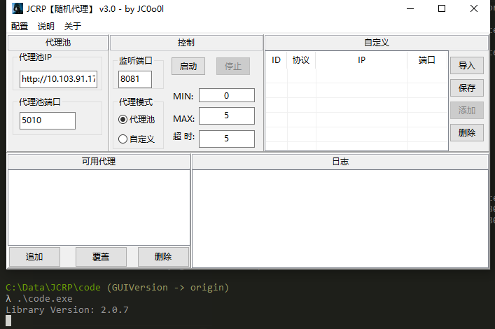

JCRandomProxy【随机代理】Gui版
```shell
Author: JC0o0l
Wechat: JC_SecNotes
```
## 功能
- http代理
- https代理
- 定时代理校验
- 随机代理

## 更新
- GUI版发布 - 20200928
- 优化日志模块 - 20201011
- 优化配置模块 - 20201214
  - 可以自定义是否校验代理
  - 可以自定义校验代理的网址，但需满足如下条件：
    - 若代理有效，则代理ip需要包含在响应body中
- Fix：校验代理时无法获取代理

## 不足
- 取决于所获取到的代理的质量
- 配置模块不完善

## 效果

开启后，在浏览器中配置http代理，之后查看IP，结果如下：


## 步骤
提前配置好[proxypool](https://github.com/jhao104/proxy_pool)

项目地址为： `https://github.com/jhao104/proxy_pool`

1\. 从GitHub上clone Gui版本的代码
```shell
git clone -b GUIVersion https://github.com/chroblert/JCRandomProxy.git
```
2\. 从release中下载最新版二进制程序
```shell
https://github.com/chroblert/JCRandomProxy/releases
```
3\. 执行后，界面如下



> 执行后会发现出现一个cmd框，这个是故意这样的，方面出错时调试用的。若要不弹框，则需要使用如下命令重新进行编译
> ```shell
> go build -i -ldflags="-H windowsgui"
> ```
4\. 配置
图中有代理池、控制以及自定义三个面板是需要在启动前配置，说明如下：

代理池：
 - 代理池IP： 自己部署的proxypool所在的服务器IP
 - 代理池端口：自己部署的proxypool对外开放的端口

自定义：
 - 导入：打开对话框，从文件中导入代理到元代理池中
 - 保存：将自定义框中的代理保存到proxy.lst文件中去
 - 添加：手动输入代理
 - 删除：从元代理池中删去选定的代理
  > 元代理池是自定义模式下的概念：代表从文件中或手动添加的没有经过校验的代理存放的地方
  >
  > 要导入的文件中，每行一个代理，格式如下：
  > `protocol,ip:port`
  >
  > 例如：`http,127.0.0.1;8081`

控制：
 - 监听端口：JCRP监听在哪个端口
 - 代理模式：
   - 代理池：从proxypool中获取代理
   - 自定义：从文件中导入代理
 - 启动： 启动代理
 - 停止：停止代理
 - MIN：当可用代理池中的代理数量小于MIN时，则开始获取代理
 - MAX：当可用代理池中的代理数量等于MAX时，则停止获取代理
 - 超时：校验代理是否可用时的超时时间，以秒为单位

5\. 启动

点击启动后，JCRP会收集MAX数量的可用代理,从左下框中可以看到


6\. 可用代理操作说明

- 追加： 将可用代理池中代理追加到proxy.lst文件中去
- 覆盖： 将可用代理池中代理覆盖到proxy.lst文件
- 删除： 删除可用代理池中选中的代理


**注：要将liblcl.dll文件放置到windows/system32目录下**
